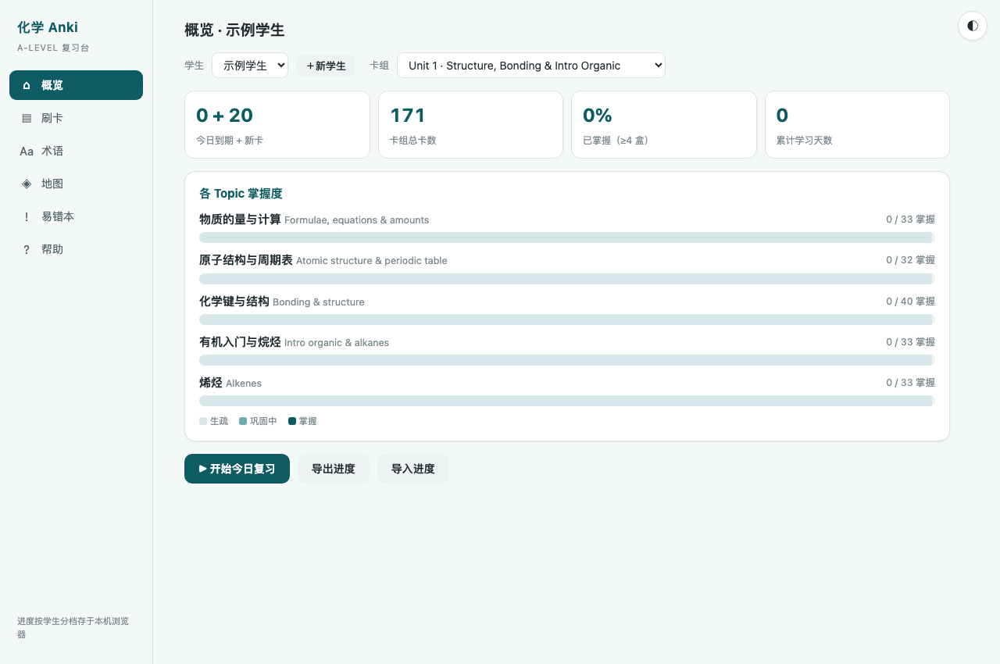
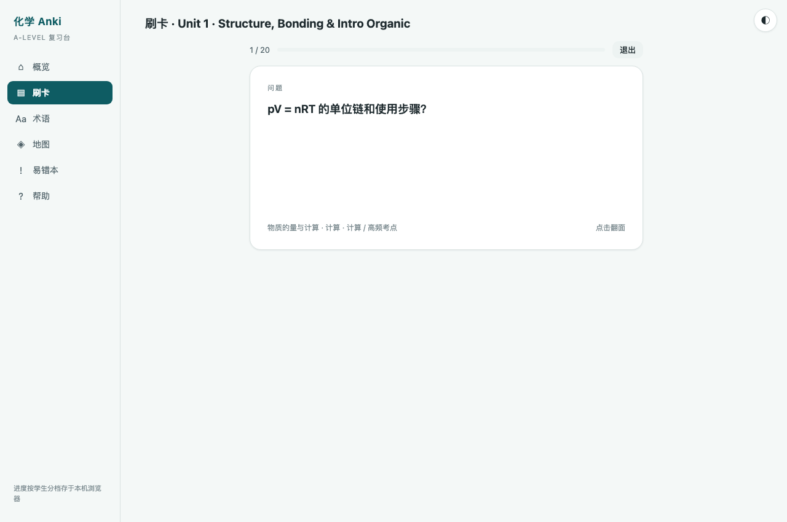

# 化学 Anki · A-Level 复习台

给 A-Level（爱德思 IAL）化学学生的**零依赖**本地刷卡工具：间隔重复闪卡 + 英文术语自测 + 知识地图 + 易错本。

没有构建步骤、没有 npm、没有后端、不联网也能用——**下载后双击 `index.html`** 就开始复习。



## 为什么不用 Anki 本体

Anki 很好，但对 A-Level 学生有三个不合手的地方，这个工具就是冲着它们做的：

| | Anki | 本工具 |
|---|---|---|
| 上手 | 装客户端、导入 apkg、配置牌组 | 双击 HTML |
| 卡片内容 | 通用模板，自己一张张录 | 按 Edexcel **mark scheme 口径**预写，含"判死条款" |
| 知识地图 | 无 | 每个 Topic 一张，⚠ 标高频丢分点，可投屏可打印 |
| 老师用 | 学生各自装 | 一个文件夹发给全班，进度各自存本机 |

## 功能

- **概览** — 各 Topic 三档掌握度（生疏 / 巩固中 / 掌握）、今日到期数
- **刷卡** — Leitner 盒 0–5，间隔 0/0/1/3/7/14 天；快捷键 `空格` 翻面、`1`/`2`/`3` 评分
- **术语** — 全部英文术语 + 考试级定义；「遮中文 / 遮英文」当堂听写
- **地图** — 知识地图，⚠ 橙色＝高频丢分点；条目可点开出真题切片，再点出 mark scheme 原图
- **易错本** — 所有 MS 判死条款汇总，考前 30 分钟专用
- **多学生** — 左上角切换 / 新建，进度各自独立
- **换设备** — 「导出进度」下载 JSON，新设备「导入进度」



## 快速开始

```bash
git clone https://github.com/Ronchy2000/alevel-chem-anki.git
```

然后双击 `index.html`（Chrome / Safari / Edge 均可）。

如果浏览器因本地文件安全策略拦住卡组加载，起个静态服务器即可：

```bash
python3 -m http.server 8000
```

再访问 `http://localhost:8000`。

## 项目结构

```
index.html                    单文件应用（约 34 KB，含全部样式与逻辑）
decks/
  _template.js                空白卡组模板，复制它开始写
  deck_u1.js                  Unit 1 (WCH11) 全考点：171 卡 + 118 术语 + 知识地图
  deck_u2.js                  Unit 2 (WCH12) 全考点：165 卡 + 111 术语 + 知识地图
  deck_demo_u1_errors.js      「按学生建错题组」示例（已匿名）
  media/                      知识地图挂载的真题 / mark scheme 切片图
```

## 加自己的卡组

三步：

1. 复制 `decks/_template.js` 改名，填内容
2. 在 `index.html` 的「卡组数据」注释区加一行 `<script src="decks/你的文件.js"></script>`
3. 刷新页面

### 卡组 schema

```js
window.CHEM_DECKS = window.CHEM_DECKS || [];
window.CHEM_DECKS.push({
  id: "u3", title: "Unit 3 · Practical Skills", exam: "WCH13",
  topics: [{
    id: "t1", title: "滴定", cn: "Titration",
    branches: [{ label: "配制标准溶液", items: [ /* 见下 */ ] }],
    terms:  [{ en: "burette", cn: "滴定管", def: "graduated to 0.1 cm³…" }],
    cards:  [{ type: "concept", front: "…", back: "…", tags: ["高频考点"] }]
  }]
});
```

**卡片三种 `type`**

| type | 用途 | 写法 |
|---|---|---|
| `concept` | 概念 / 定义 / 解释模板 | 正面提问，背面给可直接抄进卷子的英文表述 |
| `calc` | 计算 | 背面写完整步骤含单位，标出采分点 |
| `error` | 易错（会汇入「易错本」） | 三段式：`✗ 错误写法\n✓ 正确写法\nMS 口径` |

**知识地图条目三种形态**，可在同一个 `items[]` 里混用：

```js
items: [
  "普通条目，纯展示",                                  // 字符串
  { t: "带自测的条目", q: "问题", a: "答案" },          // 点击出题
  { t: "挂真题的条目", y: "2023.6 真题 · Q20",
    focus: "重点看 (a)(i)–(ii)",
    qimg: ["decks/media/2023_6_q20_p11.jpg"],        // 点击出原题
    aimg: ["decks/media/2023_6_q20_ms14.jpg"] }      // 再点出 MS
]
```

条目文本以 `⚠` 开头会显示为橙色高频丢分点。

## 数据与隐私

进度全部存在**你自己浏览器的 localStorage**（键名 `ck.data.<学生名>`），不上传任何地方，本仓库也不收集任何数据。清浏览器数据会丢进度，换设备前先用「导出进度」。

## 内容说明与版权

- **代码**：MIT License，随便用。
- **卡片内容**：由 AI 起草、独立 AI 审核、再经老师终审的三道工序产出（U1 那批审核出 11 处事实错误，U2 出 9 处）。即便如此仍可能有错——**发现问题请提 issue 或 PR**，尤其是 mark scheme 口径类的。内容按 [CC BY-NC-SA 4.0](https://creativecommons.org/licenses/by-nc-sa/4.0/deed.zh) 分享。
- **`decks/media/` 内的真题与 mark scheme 切片**：版权归 **Pearson Edexcel** 所有，此处仅作个人学习与教学讲评之用，不作任何商业用途。若权利方要求，会立即移除。
- 本项目与 Pearson / Edexcel 无任何隶属或背书关系。

## 贡献

最需要的三类 PR：

1. **纠错** — 卡片内容或 MS 口径写错了
2. **补单元** — U3–U6 卡组（照 `deck_u1.js` 的规格写）
3. **其他考局** — CIE / AQA / OCR 版卡组

提 PR 前请确认卡组文件能被 `node -e "new Function('window', require('fs').readFileSync('decks/你的文件.js','utf8'))({})"` 解析通过。
